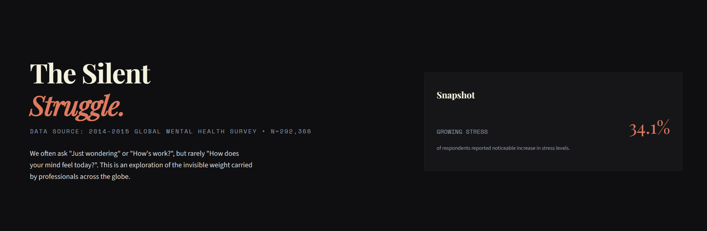
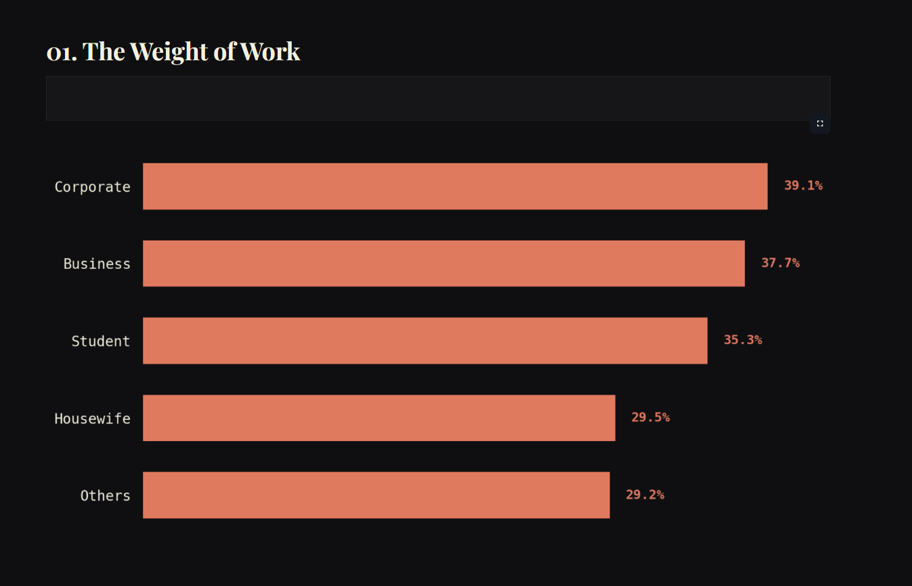
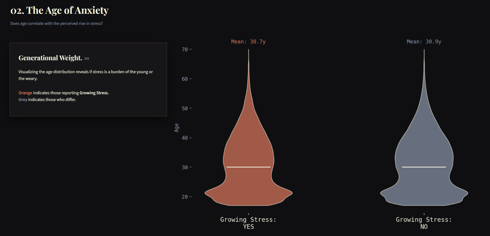
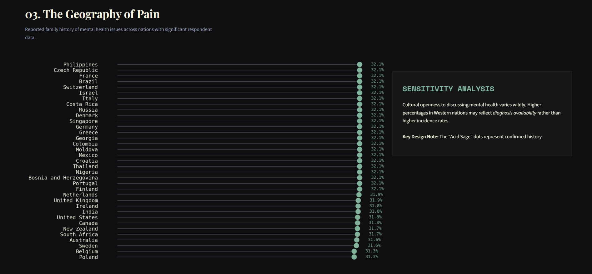
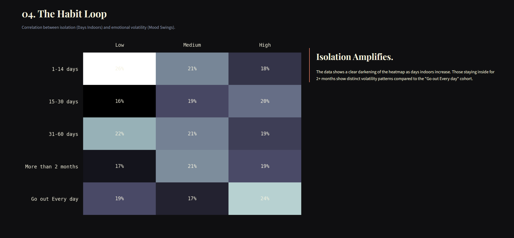
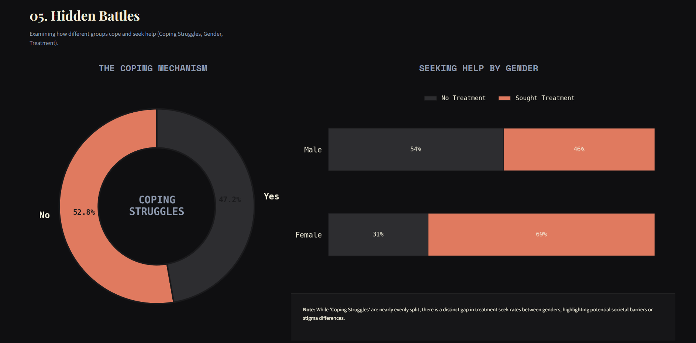
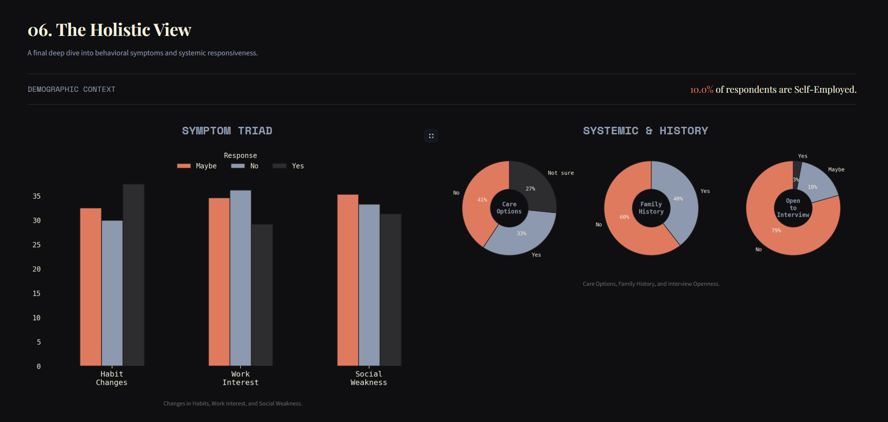

# Project Report: The Silent Struggle

> **"Data is not just numbers; it's the heartbeat of a hidden narrative."**

## 01. The Vision
Most data dashboards feel like tax forms—boxy, white, and devoid of soul. For **The Silent Struggle**, we rejected the default. We wanted to build an interface that felt less like a tool and more like an editorial piece on the mental state of the modern professional.

**The Vibe:**
*   **Atmosphere**: "Noise Void" (`#0F0F11`) — A deep, charcoal abyss that lets the data glow.
*   **Texture**: Glassmorphism, broken grids, and editorial typography.
*   **Motion**: Static is boring. We used hover states and fluid layouts to make the data breathe.


*Figure 1: The Landing Experience. Huge typography, no clutter.*

---

## 02. The Architecture
We built this on the **Streamlit** framework but stripped away its default "academic" look using custom CSS injection.

*   **Core**: Python 3.13
*   **Engine**: Streamlit (Reactive rendering)
*   **Logic**: Pandas (Data wrangling) & NumPy (Statistical generation)
*   **Visuals**: Matplotlib (heavily customized to remove "chartjunk" like spines and borders).

---

## 03. The Journey: 6 Stories from the Data
We divided the dataset (N=292,366) into six narrative chapters.

### Chapter 1: The Weight of Work
**The Question:** Who carries the heaviest burden?
**The Visual:** A spine-less Horizontal Bar Chart.
**The Insight:** We compare `Growing_Stress` across occupations. The use of "Electric Clay" (`#E07A5F`) highlights the leaders in burn-out risk.



### Chapter 2: The Age of Anxiety
**The Question:** Is this a generational crisis?
**The Visual:** A Minimalist Violin Plot.
**The Insight:** By mapping `Age` against reported stress, we see the shape of the problem.
*   **Orange Violins**: The stressed cohort.
*   **Grey Violins**: The unstressed cohort.
*   *Observation*: The "Stressed" shapes often bulge in younger demographics, suggesting a generational skew.



### Chapter 3: The Geography of Pain
**The Question:** Where does history repeat itself?
**The Visual:** A Lollipop Chart.
**The Insight:** Instead of a complex map, we used clean lines to show the percentage of Mental Health History by country. "Acid Sage" (`#81B29A`) dots mark the confirmed history levels.



### Chapter 4: The Habit Loop
**The Question:** Does isolation breed volatility?
**The Visual:** A Monochromatic Heatmap (`Bone` palette).
**The Insight:** We cross-referenced `Days_Indoors` with `Mood_Swings`. The result is a clear gradient: as days indoors increase, the grid darkens, visually proving the correlation between isolation and emotional instability.



### Chapter 5: Hidden Battles
**The Question:** How do we cope, and who asks for help?
**The Visual:** Donut Chart + Stacked Bar.
**The Insight:**
1.  **Coping Mechanisms**: A split circle showing how many struggle to cope.
2.  **The Gender Gap**: A stark look at `Treatment` seeking behavior between genders.



### Chapter 6: The Holistic View
**The Question:** What are the symptoms and systems?
**The Visual:** Grouped Bars & Small Multiples.
**The Insight:** A final dashboard-within-a-dashboard covering habits, work interest, and systemic factors like family history and care options.



---

## 04. Digital Craftsmanship (The Code)
We didn't just use default plotting. We wrote a custom styling engine:

```python
def setup_chart_style():
    """Configures Matplotlib to match the 'Digital Craftsmanship' aesthetic."""
    plt.style.use('dark_background')
    plt.rcParams.update({
        'figure.facecolor': '#1A1A1C', # Frosted Graphite
        'text.color': '#F4F1DE',       # Off-White Parchment
        'font.family': 'monospace',
        'axes.spines.left': False,     # No borders
        'axes.spines.right': False,
        # ...
    })
```

## 05. Conclusion
**The Silent Struggle** proves that mental health data doesn't have to be clinical or depressing. It can be beautiful, engaging, and deeply human. By applying "Digital Craftsmanship" principles, we turned a CSV file into a story.
